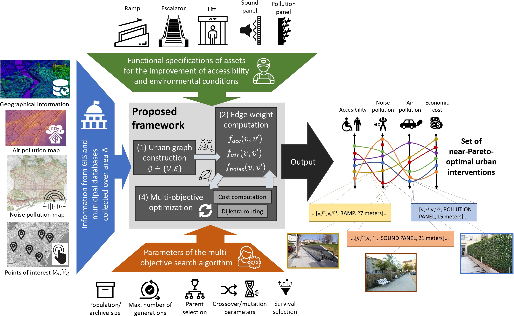

# A Framework to Improve Accessibility and Urban Environmental Conditions in Age-friendly Cities using Graph Modeling and Multi-objective Optimization
Repository containing datasets and simulations scripts for the multi-objective optimization of accessibility, air pollution and environmental noise reduction assets in age-friendly cities

>The rapid growth of cities in recent decades has unleashed several challenges for urban planning, which have been exacerbated by their ageing population. Among the most pressing problems in cities are those related to mobility and environmental quality, by which a global concern has flourished around enhancing pedestrian accessibility for both environmental and health-related reasons. To tackle this issue, this paper presents a new framework that combines multi-objective optimization with a graph model that aims to support urban planning and management. The framework allows designing urban projects that improve accessibility, reduce noise and/or pollution through the installation of urban elements (ramps and escalators, elevators, acoustic and vegetation panels), while taking into account the overall economic cost of the installation. To explore the trade-off between these objectives, we resort to multi-objective evolutionary algorithms, which permit to compute near Pareto-optimal interventions over the graph model of the urban area under study. We showcase the applicability of the proposed framework over two use cases in the city of Barcelona (Spain), both quantitatively and qualitatively. The results evince that the framework can effectively help urban planners make informed decisions towards enhancing urban accessibility and environmental quality of age-friendly cities. 



# Citing this work:

#### Conditional Generative Adversarial Networks

*I\~nigo Delgado-Enales, Javier Del Ser, Patricia Molina*

(https://arxiv.org/search/eess?searchtype=author&query=Del+Ser%2C+J)

```
@article{delgadoenales22journal,
  title={{A Framework to Improve Accessibility and Urban Environmental Conditions in Age-friendly Cities using Graph Modeling and Multi-objective Optimization}},
  author={Delgado-Enales, I\~nigo and Del Ser, Javier and Molina, Patricia},
  journal={Under review, preprint available at arXiv},
  year={2022}
}
```

### Contact:

Iñigo Delgado-Enales, inigodelgado22@gmail.com
Javier Del Ser, javier.delser@tecnalia.com
Patricia Molina, patricia.molina@tecnalia.com
